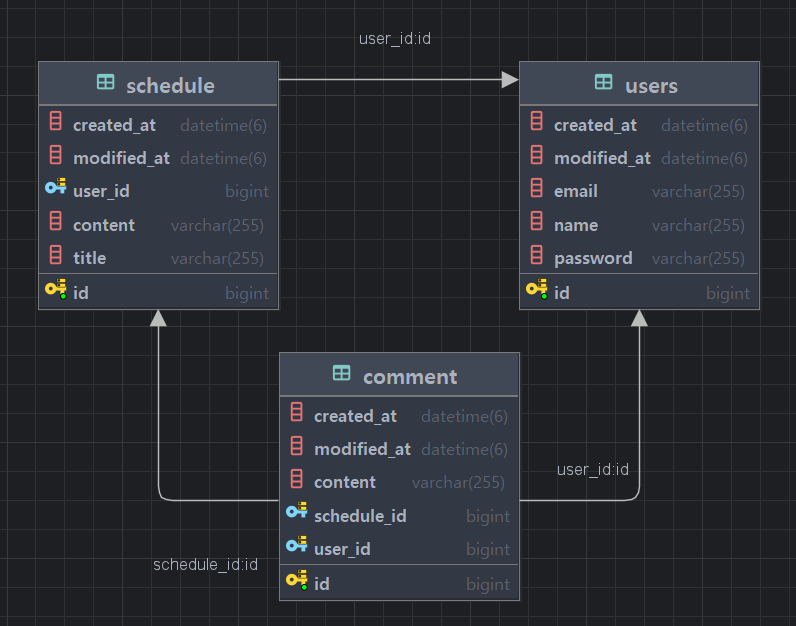

# 🗓 Sparta Scheduler Develop

스파르타 코딩캠프 **일정 관리 애플리케이션** 프로젝트입니다.  
Java + Spring Boot 기반으로 JPA, 인증/인가, REST API 설계를 경험하며 학습했습니다.

---

## 🎯 학습 목표
- **JPA 기반 데이터베이스 관리**
    - CRUD 구조와 연관관계 이해 및 구현
- **Cookie/Session 기반 인증·인가**
    - 보안 개념과 인증/인가 메커니즘 이해 및 적용

---

## 🔑 학습 키워드

### 1. JPA를 활용한 CRUD
- 엔티티 간 **연관관계 설정**
- JPA 주요 개념을 실제 애플리케이션에 **적용·구현**

### 2. 인증 / 인가
- 애플리케이션 **보안 및 접근 제어** 방법 이해
- **Validation**을 통한 데이터 유효성 검증
- **Servlet Filter, Cookie, Session**을 활용한 인증·인가 구현


---

## 🛠 사용 기술 및 도구

- **Language**: Java 17
- **Framework**: Spring Boot
- **Build Tool**: Gradle
- **IDE**: IntelliJ IDEA
- **Version Control**: Git

---

## 📁 디렉토리 구조

````
com/
└── spartaschedulerdevelop/
    ├── common/                         # 공통 유틸, 설정, 예외 처리
    │   ├── advice/
    │   │   ├── exception/              # 전역 예외 처리(GlobalExceptionHandler), 에러 응답 구조
    │   │   └── success/                 # 성공 응답 처리(SuccessResponse, 공통 응답 래퍼)
    │   ├── config/                      # 스프링 설정(비밀번호 인코딩, Swagger, WebMvc 설정)
    │   ├── filter/                      # 인증/인가 필터 (JWT, 로그인 필터 등)
    │   ├── util/                        # 공통 유틸리티 클래스
    │   └── validation/                  # 커스텀 유효성 검사 애노테이션 및 검증 로직
    ├── controller/                      # REST API 엔드포인트
    ├── dto/                             # 요청/응답 DTO
    │   ├── comment/                     # 댓글 관련 DTO
    │   ├── login/                       # 로그인 요청/응답 DTO
    │   ├── schedule/                    # 일정 관련 DTO
    │   └── user/                        # 사용자 관련 DTO
    ├── entity/                          # JPA 엔티티
    ├── mapper/                          # DTO <- Entity 매핑 (MapStruct 등)
    ├── repository/                      # JPA Repository 인터페이스
    ├── service/                         # 비즈니스 로직
    └── SpartaSchedulerDevelopApplication # Spring Boot 메인 클래스

````

---


# API 간략 명세서

## 개요
스파르타 일정 관리 시스템 API 명세서입니다.

**Base URL:** `http://localhost:8080`

## ⚠️ 주의사항

- 모든 요청은 `Content-Type: application/json`으로 설정
- 인증이 필요한 API는 로그인 후 세션 유지 필요

### 인증 필요 API
- 일정 생성, 조회, 수정, 삭제
- 사용자 정보 수정, 조회, 삭제
- 댓글 생성, 조회, 수정, 삭제


---

## 📋 일정(Schedule) API

| Method | URL | Description |
|--------|-----|-------------|
| POST | `/schedules` | 일정 생성 |
| GET | `/schedules` | 일정 전체 조회|
| GET | `/schedules/{id}` | 일정 단건 조회 |
| PATCH | `/schedules/{id}` | 일정 수정 |
| DELETE | `/schedules/{id}` | 일정 삭제 |
| GET | `/schedules/page` | 일정 페이징 조회 |

## 👤 사용자(User) API

| Method | URL        | Description |
|--------|------------|-------------|
| POST | `/user/signup`  | 사용자 생성 |
| GET | `/user`    | 사용자 전체 조회 |
| GET | `/user/{id}` | 사용자 단건 조회 |
| PATCH | `/user/me` | 사용자 정보 수정 |
| DELETE | `/user/me` | 사용자 삭제 |

## 🔐 인증 API

| Method | URL | Description |
|--------|-----|-------------|
| POST | `/login` | 로그인 |
| POST | `/logout` | 로그아웃 |

## 💬 댓글(Comment) API

| Method | URL | Description |
|--------|-----|-------------|
| POST | `/schedules/{scheduleId}/comment` | 댓글 생성 |
| GET | `/schedules/{scheduleId}/comment` | 일정별 댓글 조회 |
| PATCH | `/schedules/{scheduleId}/comment/{commentId}` | 댓글 수정 |
| DELETE | `/schedules/{scheduleId}/comment/{commentId}` | 댓글 삭제 |

---

## 📝 공통 응답 형식

**성공 응답:**
```json
{
    "status": 200,
    "code": "SUC-001",
    "message": "요청이 성공적으로 처리되었습니다.",
    "data": { ... },
    "path": "/schedules",
    "timestamp": "2024-01-15T10:30:00"
}
```

**에러 응답:**
```json
{
    "status": 400,
    "code": "VAL-001",
    "message": "입력값이 유효하지 않습니다",
    "data": null,
    "path": "/schedules",
    "timestamp": "2024-01-15T10:30:00"
}
```

# 📘 **[👉 전체 API 명세 보기](./docs/api.md)**


---


## 📄 ERD




---

## 🙌 기여자
| 이름 | 역할 |
|------|------|
| **@soo** | 개발 및 설계, 문서 작성 |

---
## 📅 개발 기간
2025.08.07 ~ 2025.08.14 (총 8일)

---

## 📒 개발 기록 (TIL)
- [2025.08.07 - 일정 관리 앱 개발 시작](https://velog.io/@sooh59599/2025.08.07-TIL-%EC%9D%BC%EC%A0%95-%EA%B4%80%EB%A6%AC%EC%95%B1-develop-%EA%B3%BC%EC%A0%9C-%EC%84%A4%EC%A0%95)
- [2025.08.07 - MapStruct](https://velog.io/@sooh59599/2025.08.07-TIL-MapStruct)
- [2025.08.07 - Custom Annotation 만들기](https://velog.io/@sooh59599/2025.08.07-TIL-Custom-Annotation-%EB%A7%8C%EB%93%A4%EA%B8%B0)
- [2025.08.08 - 로그인 필터/예외 응답 처리](https://velog.io/@sooh59599/2025.08.08-TIL-%EB%A1%9C%EA%B7%B8%EC%9D%B8-%ED%95%84%ED%84%B0%EC%97%90%EC%84%9C-%EC%98%88%EC%99%B8-%EC%9D%91%EB%8B%B5-%ED%98%95%ED%83%9C-%ED%86%B5%EC%9D%BC)
- [2025.08.12 - 페이징, Page/Pageable, DTO Projection](https://velog.io/@sooh59599/2025.08.12-TIL-%ED%8E%98%EC%9D%B4%EC%A7%95Page-Pageable-DTO-Projection)

---

### 🐞 트러블슈팅
- [2025.08.07 - 트러블슈팅](https://velog.io/@sooh59599/2025.08.07-TIL-%ED%8A%B8%EB%9F%AC%EB%B8%94%EC%8A%88%ED%8C%85)
- [2025.08.08 - Spring Boot 3.x Swagger 충돌 500 에러 해결](https://velog.io/@sooh59599/2025.08.08-TIL-Spring-Boot-3.x-Swagger-%EC%B6%A9%EB%8F%8C-500%EC%97%90%EB%9F%AC-%ED%95%B4%EA%B2%B0-%EA%B3%BC%EC%A0%95)
- [2025.08.11 - JPA 외래 키 제약 조건 오류(SQLIntegrityConstraintViolationException)](https://velog.io/@sooh59599/2025.08.11-TIL-JPA-%EC%99%B8%EB%9E%98-%ED%82%A4-%EC%A0%9C%EC%95%BD-%EC%A1%B0%EA%B1%B4-%EC%98%A4%EB%A5%98-java.sql.SQLIntegrityConstraintViolationException)  
